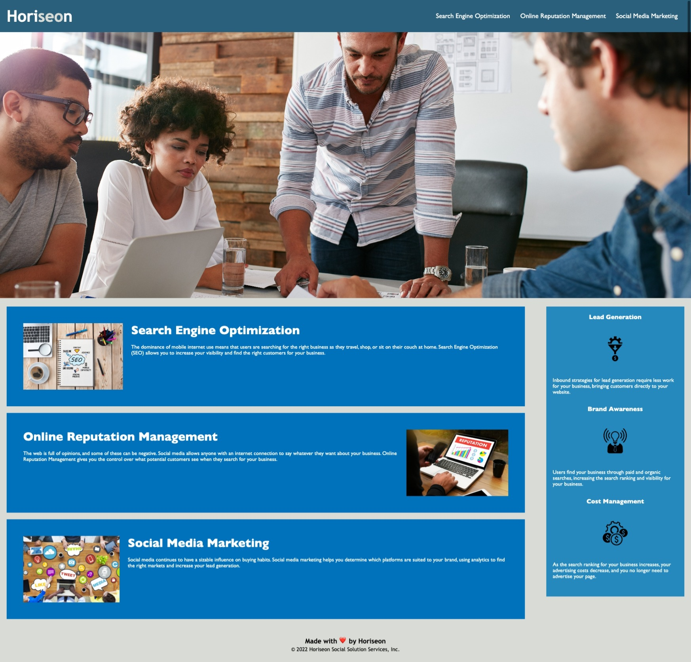

# HoriseonSS
<!-- ABOUT THE PROJECT -->
## About The Project

This website is a landing page or Horiseon SEO Services. It is entirely driven by HTML an CSS and various corrections and refactors were made in order to make them more accesibility-friendly with the use of Semantic HTML tags

* [Project Website](https://sebasmelendez.github.io/HoriseonSS/)
* [Project Repo](https://github.com/SebasMelendez/HoriseonSS)

### Built With

This project is a proof of what module 1 has taught me and it was made with:

* HTML
* CSS
* Love <3
